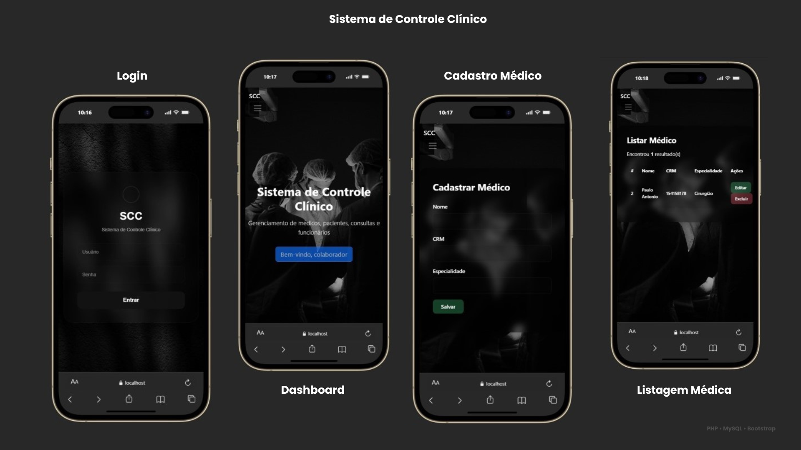

# Sistema de Controle Clínico

Sistema web desenvolvido para gerenciamento de médicos, pacientes, consultas e funcionários de uma clínica médica.

O projeto foi desenvolvido utilizando PHP, MySQL e Bootstrap, com foco em um design moderno, dark mode e interface responsiva.

---

## Preview do Sistema



---

## Funcionalidades

### Login
- Sistema de autenticação
- Controle de sessão
- Logout automático

### Médicos
- Cadastro de médicos
- Edição de informações
- Exclusão de registros
- Listagem completa

### Pacientes
- Cadastro de pacientes
- Controle de dados pessoais
- Listagem de pacientes
- Edição e exclusão

### Consultas
- Agendamento de consultas
- Associação entre médico e paciente
- Controle de data e horário
- Descrição da consulta

### Funcionários
- Cadastro de funcionários
- Controle de cargo
- Status de funcionário

---

## Interface

O sistema possui:
- Design dark mode
- Efeito glassmorphism
- Layout responsivo
- Interface moderna para dispositivos móveis

---

## Tecnologias Utilizadas

- PHP
- MySQL
- Bootstrap
- HTML5
- CSS3
- JavaScript

---

## Responsividade

O sistema foi adaptado para:
- Desktop
- Tablets
- Smartphones

---

## Como Executar o Projeto

### Clonar o repositório

```bash
git clone https://github.com/SEU-USUARIO/clinica-banco-de-dados-SQL.git
```

---

### Mover para o XAMPP

Coloque a pasta do projeto em:

```text
C:\xampp\htdocs
```

---

### Iniciar o XAMPP

Ative:
- Apache
- MySQL

---

### Importar o banco de dados

1. Abra o phpMyAdmin
2. Crie um banco chamado:

```text
clinica
```

3. Importe o arquivo:

```text
modelagem.sql
```

---

### Acessar o sistema

```text
http://localhost/clinica-banco-dados
```

---

## Desenvolvido por

Flávia Rosa


